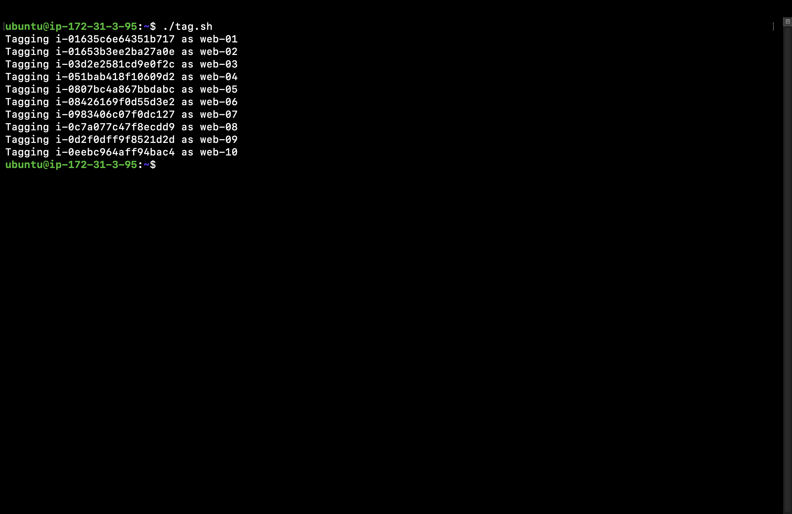
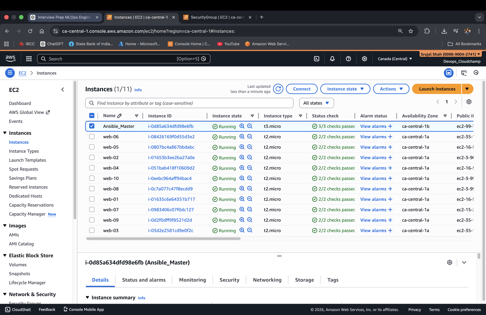
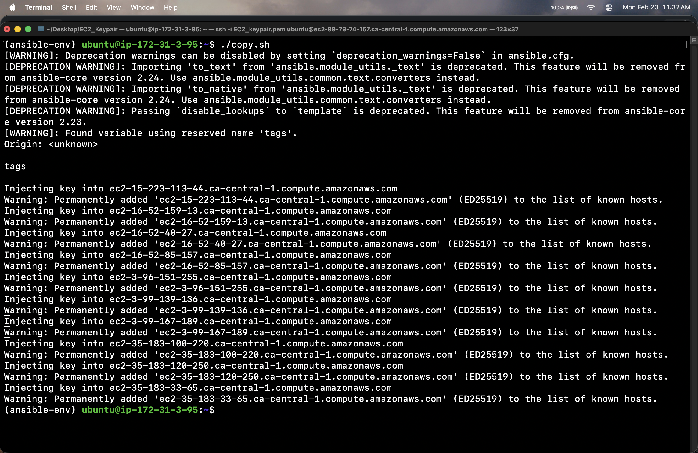
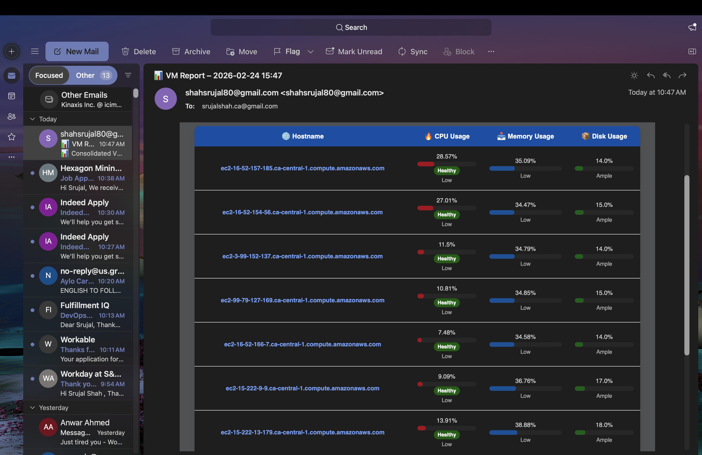

# VM Health Monitoring & Reporting Automation

Automated **VM provisioning, monitoring, and reporting** using Ansible, AWS, and HTML email notifications. This project demonstrates **infrastructure as code (IaC)**, secure SSH automation, and real-time metrics reporting for DevOps workflows.

---

## 🚀 Features

- **Provision & Tag VMs**: Automatically launch and tag 10 AWS EC2 instances with consistent naming and environment labels.  
- **Secure SSH Access**: Inject SSH keys programmatically for passwordless, secure access.  
- **VM Metrics Collection**: Gather CPU, memory, and disk usage from all VMs.  
- **Automated Reporting**:
  - Generate HTML reports with visual health indicators (CPU, memory, disk).  
  - Email reports automatically via Gmail SMTP.  
- **Terminal Output**: Quick summary of metrics available in the terminal for on-the-go checks.  
- **Scalable & Modular**: Designed to easily extend to more VMs or other cloud environments.  

---

## 📂 Project Structure
├── Inventory/
│ └── aws_ec2.yaml
├── group_vars/
│ └── all.yaml
├── templates/
│ └── report_email_animated.html.j2
├── playbooks/
│ ├── collect_metrics.yaml
│ └── send_report.yaml
├── Screenshots/
│ ├── terminal_metrics.png
│ └── html_report.png
└── README.md

---

## ⚙️ Technologies Used

- **Automation & Configuration:** Ansible  
- **Cloud:** AWS EC2  
- **Monitoring & Reporting:** Jinja2, HTML, Bash  
- **Email Notifications:** Gmail SMTP  
- **Security:** SSH key injection for secure access  

---

## 📊 Sample Output

### Terminal Metrics Output

### AWS Console Output

### Terminal Metrics Output

### HTML Email Report

---

## 🔐 Security Notes

- Use **Gmail App Passwords** instead of your main password for SMTP.  
- SSH keys are injected securely during provisioning for passwordless access.  

---

## 📂 Future Improvements

- Add support for **AWS Lambda** notifications.  
- Extend monitoring to include **network metrics**.  
- Integrate with **Slack/MS Teams** for real-time alerts.  
- Containerize the project for **multi-cloud deployments**.

---

## 📜 License

MIT License

---
